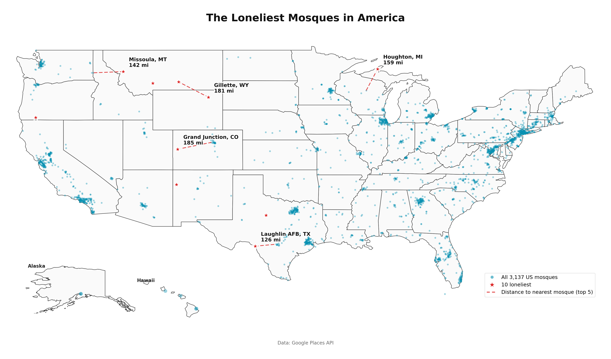

# Mapping Every Mosque in America

I used the Google Places API to discover and catalog **3,137 operating mosques across all 50 US states + DC**, then computed which ones are the most geographically isolated — the "loneliest mosques in America."



## What is the Loneliest Mosque ?

When I did a quick search on this question before starting this project, the answer I received was it might potentially be a mosque in Fairbank, Alaska. Upon doing some research the mosque was no longer operating since pandemic. What the answer ended up being was an unexpected one for me in Grand Junction, CO. The entire western slope of Colorado served by one mosque. Utah's Salt Lake mosques are actually closer but across a mountain range. Its nearest fellow mosque is **185 miles away** in Golden, CO.
It's one of at least ten US mosques whose nearest neighbor is more than 100 miles away.

## Top 10 Loneliest Mosques

| # | Mosque | City | State | Distance to nearest mosque |
|---|---|---|---|---|
| 1 | Islamic Center of Grand Junction | Grand Junction | CO | 185 mi |
| 2 | Queresha Mosque | Gillette | WY | 181 mi |
| 3 | Mosque MichiganTech | Houghton | MI | 159 mi |
| 4 | Missoula Islamic Society | Missoula | MT | 142 mi |
| 5 | Laughlin Mosque | Laughlin AFB | TX | 126 mi |
| 6 | Masjid e Aamina | Abilene | TX | 126 mi |
| 7 | Islamic Center of Bozeman | Bozeman | MT | 125 mi |
| 8 | Billings Islamic Center | Billings | MT | 125 mi |
| 9 | Gallup Islamic Center | Gallup | NM | 121 mi |
| 10 | Al-Tawheed Mosque | Talent | OR | 114 mi |

Full list: [results/top10_loneliest.csv](results/top10_loneliest.csv)

## Coverage by state

Top 10 states:

| State | Mosques |
|---|---|
| New York | 474 |
| California | 346 |
| Texas | 293 |
| Florida | 161 |
| Illinois | 157 |
| New Jersey | 150 |
| Michigan | 139 |
| Pennsylvania | 119 |
| Georgia | 113 |
| Virginia | 105 |

Full breakdown across 50 states + DC: [results/mosques_per_state.csv](results/mosques_per_state.csv)

## How I built this

### Seeding: Google Places API with a recursive search

I used the [Places API (New)](https://developers.google.com/maps/documentation/places/web-service/overview) with two strategies depending on state density:

- **Dense states (CA, TX, NY, IL, MI, …)**: `searchNearby` with a grid of overlapping 15 km circles. Critical detail: `rankPreference: DISTANCE` — the default `POPULARITY` ranking silently drops small mosques once a tile exceeds 20 results, so switching to distance was the biggest single coverage improvement.

- **Sparse states (WY, VT, AK, …)**: `searchText` with the state's bounding box as a `locationRestriction` rectangle. Far cheaper than a grid when the state has fewer than 60 mosques.

- **Recursive quadrant splitting**: when a `searchText` call returns 60 results (the API's page-limit cap), the script splits the bbox into four quadrants and queries each. Recurses up to depth 8 for NYC, which is dense enough that even small neighborhoods saturate the cap.

### Filtering

A place is kept if:

- `businessStatus == OPERATIONAL`
- `userRatingCount >= 3` — drops ghost listings
- `primaryType == "mosque"` **OR** has a website or phone — accepts places Google mis-types as `religious_institution` / `community_center` when they have real contact info
- Not a non-prayer sub-facility (name doesn't match `food pantry`, `food bank`)
- Not Ahmadiyya (excluded per mainstream Sunni/Shia classification — filtered by name/website, some still managed to slip by)

### Deduplication

Two mosques are considered the same entity if:
- They share the **same formatted address** (catches Google's duplicate listings), OR
- They share a website or phone AND are within 100 meters (organizations with multiple physical mosques are correctly preserved as separate entries, eg: in Bolingbrook, IL)

## Running the scripts yourself

### Prerequisites

- Python 3.11+
- A Google Cloud project with Places API (New) enabled
- A Google Places API key

### Setup

```bash
git clone https://github.com/YOUR_USERNAME/us-mosques.git
cd us-mosques
python3 -m venv .venv
source .venv/bin/activate
pip install -r requirements.txt
```

### Configure your API key

```bash
echo "GOOGLE_PLACES_API_KEY=your_key_here" > .env
```

### Seed a state or a group

```bash
# Single state
.venv/bin/python seed_mosques_google.py california

# Sparse states group (24 states that fit in one searchText call each)
.venv/bin/python seed_mosques_google.py sparse

# Multiple states
.venv/bin/python seed_mosques_google.py new_york new_jersey pennsylvania
```

Output: `data/mosques_google_<state>.json`

### Run the analysis

```bash
.venv/bin/python analysis/generate_summaries.py    # writes state counts + loneliest CSVs
.venv/bin/python analysis/loneliest_mosques_map.py # generates the map PNG
```

## Approximate costs

Running the full nationwide pipeline cost me roughly **$12–15** in Google Places API usage, well within Google's $300 free trial credit.

| Batch | Tiles/calls | Approx cost |
|---|---|---|
| Sparse states (24, searchText) | ~30 | ~$1 |
| Medium states (17, text + auto-split) | ~150 | ~$4 |
| Dense states (9, deep recursive split) | ~250 | ~$8 |
